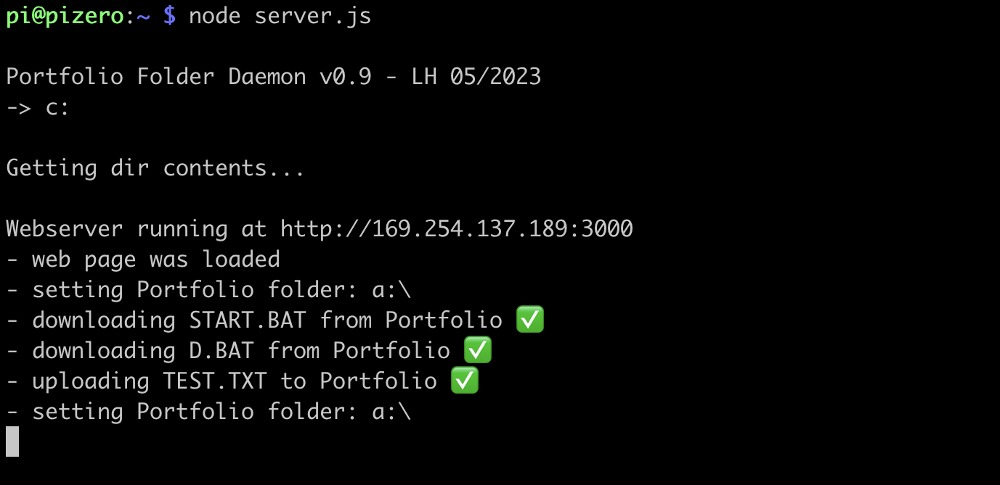

# PiPortfolioDaemon

*Disclaimer*: This is a work in progress!

- Author: Lennart Hennigs (<https://www.lennarthennigs.de>)
- Copyright (C) 2023 Lennart Hennigs.
- Released under the MIT license.
- To see the latest changes look at the [Changelog](https://github.com/LennartHennigs/PiPortfolioDaemon/blob/master/CHANGELOG.md).
- If you find this library helpful please consider giving it a ⭐️ at [GitHub](https://github.com/LennartHennigs/Button2) and/or [buy me a ☕️](https://ko-fi.com/lennart0815).

Thank you!

## Description

- This is a NodeJS web server that runs on a Raspberry Pi, connected to the Portfolio's Parallel interface.
- It offers web interface to upload and download software to and from the Portfolio.
## Introduction

The [Atari Portfolio](https://en.wikipedia.org/wiki/Atari_Portfolio) was the first palmtop computer.
Using and experiencing one today is hard, as you have hard time putting any files onto it.

- The storage cards it uses are no longer produced ([Bee Cards](https://en.wikipedia.org/wiki/Bee_Card_(game_cartridge))) and kind of rare.
- To transfer files you need the [Atari Portfolio Parallel Interface](https://www.atari-computermuseum.de/hpc_peri.htm)...
- ... and a PC that actually still has a parallel port...
- ... and a transfer program like [transfolio](http://www.pofowiki.de/doku.php?id=software:vorstellung:exchanges:transfolio)

Without the above the Atari is only a pretty plastic brick.

To fix this, I wanted to provide an easy way to transfer data to the Portfolio for modern computers.
## Functions

- Provides a web page on `[Pi IP-Address]:3000``
- There you can...
  - list folder content on the Portfolio
  - download files
  - upload files
  - see an activitiy log
- In addition, it watches a shared SAMBA folder for uoloaded files to send them to the Portfolio.

<kbd></kbd>
<kbd></kbd>

## Prerequisites

- Atari Portfolio with Parallel Interface
- Raspberry Pi (Zero)
- Pi to Atari Portfolio Parallel adapter (I built my own, see picture below)
- NodeJS installed on the Pi
- [rpfolio](https://github.com/LennartHennigs/transfolio) (Transfolio for the Pi) installed on the Pi
- Nice to have: A shared SAMBA folder on the Pi

## How To Use

- copy files on 

<kbd></kbd>
<kbd></kbd>
