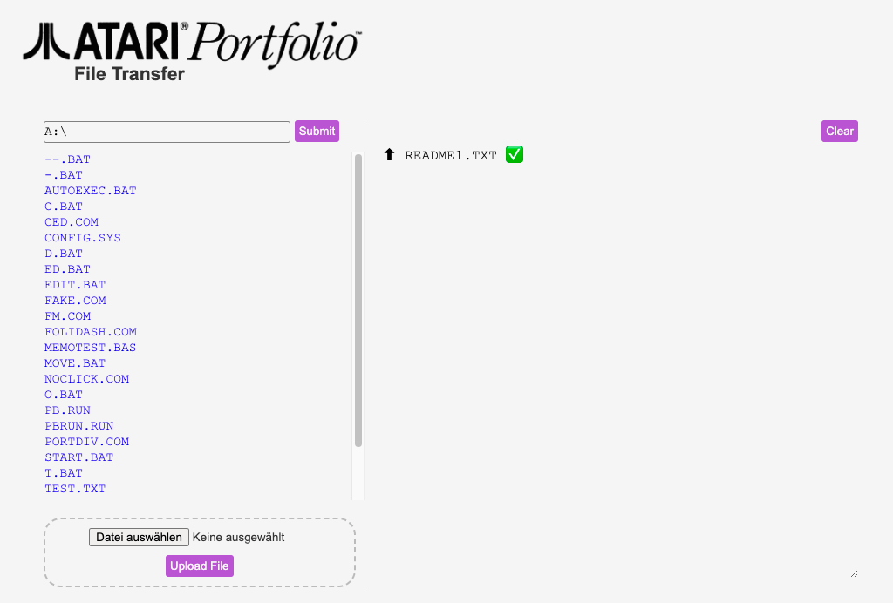
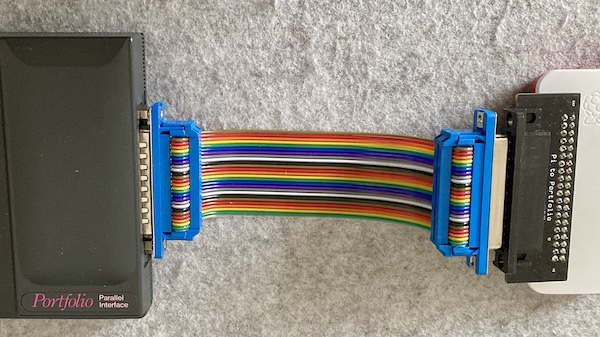
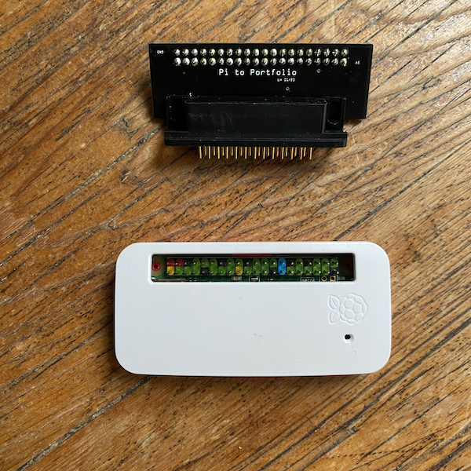

# PiPortfolioDaemon

NodeJS daemon that helps to upload and download files from a Pi to a Atari Portfolio.

- Author: Lennart Hennigs (<https://www.lennarthennigs.de>)
- Copyright (C) 2023 Lennart Hennigs.
- Released under the MIT license.

*Disclaimer*: This is a work in progress!

## Description

- This is Raspberry Pi web server that makes transferring files to the Atari Portfolio easier.
- It is based on NodeJS.

To see the latest changes to the library please take a look at the [Changelog](https://github.com/LennartHennigs/PiPortfolioDaemon/blob/master/CHANGELOG.md).

If you find this library helpful please consider giving it a ⭐️ at [GitHub](https://github.com/LennartHennigs/Button2) and/or [buy me a ☕️](https://ko-fi.com/lennart0815).

Thank you!

## Functions

- It watches a shared SAMBA folder for files for uploads.
- If files are detected in it sends them via [rpfolio](https://github.com/LennartHennigs/transfolio) to the Atari Portfolio.
- It provided a web interface to change the target folder.
- You can also download files from the web interface.
- It also provides a list history of the file transfers.

<kbd></kbd>

## Prerequisites

- Atari Portfolio with Parallel Adapter
- Raspberry Pi (Zero)
- Pi to Atari Portfolio Parallel adapter (Ibuilt my own, see picture below)
- [rpfolio](https://github.com/LennartHennigs/transfolio) (Transfolio for the Pi)
- A shared SAMBA folder on the Pi
- NodeJS installed on the Pi

<kbd></kbd>
<kbd></kbd>
